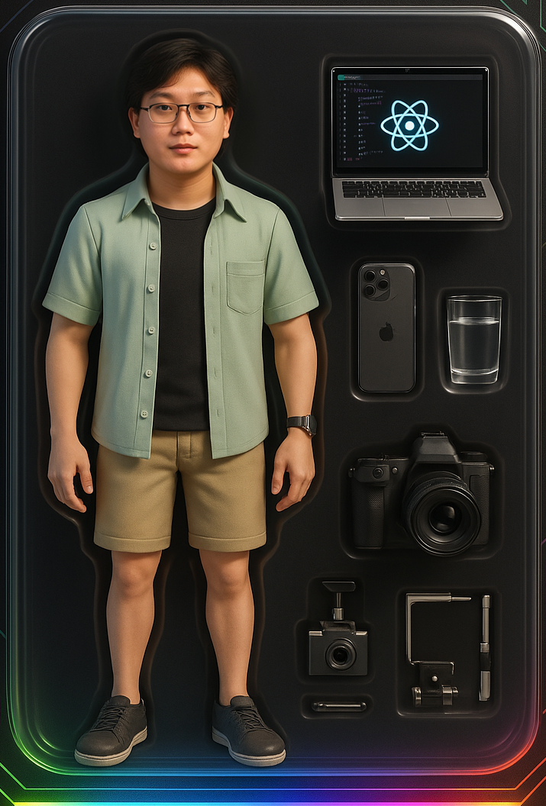

# Tran Anh Duc
**Senior React Native & AI Integration Specialist**  
Founder @ AI Interview Assistant

<p align="center">
  <a href="https://porfolio-eight-henna.vercel.app/"></a>
  <a href="https://github.com/ocean28799"></a>
  <a href="https://linkedin.com/in/trananhduc99"></a>
  <a href="mailto:ocean28799@gmail.com"></a>
</p>

---

<div align="center">
  
  <h3>Building next-gen mobile & web apps with AI</h3>
  <p>4+ years | 50+ apps | 2M+ users | 15+ countries | 95% client satisfaction</p>
</div>

---

## � About Me

Senior React Native & AI Integration Specialist with a proven track record delivering enterprise-grade mobile and web applications. Founder of AI Interview Assistant (85% improved job seeker success rate). Specialized in scalable, cross-platform solutions with cutting-edge AI (OpenAI GPT-4o, computer vision, ML models).

---

## 💡 Highlights

- 50+ enterprise apps deployed (iOS, Android, Web)
- 2M+ users served globally, 95% client satisfaction
- 15+ countries with successful project launches
- 95% accuracy in AI-powered features, 50ms response times
- $500K+ generated in client revenue via performance optimizations
- 100% client retention with enterprise-grade solutions

---

## 🛠️ Tech Stack

**Frontend:** Next.js 15+, React Native, TypeScript, Tailwind CSS, Framer Motion, shadcn/ui, MagicUI, AceternityUI  
**AI/ML:** OpenAI GPT-4o, DALL-E 3, Whisper API, TensorFlow.js, Computer Vision, Vector DB  
**Backend:** Node.js, Express.js, REST APIs, GraphQL, Microservices  
**Database:** PostgreSQL, MongoDB, Redis, Supabase, Prisma, Vector DB  
**Cloud/DevOps:** AWS, Vercel, Docker, CI/CD, GitHub Actions  
**State:** Zustand, Redux Toolkit, React Query, Context API  
**Other:** Stripe, WebRTC, Socket.io, MQTT, Payment APIs

---

## ✨ Key Projects

- **AI Virtual Assistant**: Multi-modal AI, voice-to-text, real-time sync (10K+ users, 95% accuracy)
- **Smart Analytics Platform**: AI-powered insights, predictive modeling, real-time dashboards (500+ enterprises)
- **AI Content SaaS**: Multi-modal content generation, brand voice, analytics (1000+ brands)
- **Smart Home IoT**: AI-driven automation, 100+ device types, edge computing (12 countries)
- **Fintech Trading Platform**: AI trading signals, portfolio optimization, biometric security (50K+ traders)
- **E-commerce Marketplace**: AI recommendations, dynamic pricing, inventory forecasting (1M+ products)
- **Health Monitoring App**: AI symptom analysis, telemedicine, medical image analysis (HIPAA compliant)
- **AI Tutoring LMS**: Adaptive learning, real-time collaboration, multi-language (100K+ students)

---

## 💼 Services & Pricing

| Service                              | Price/Range                         |
|--------------------------------------|-------------------------------------|
| Senior React Native/Next.js Dev      | $15/hour                            |
| Full-stack AI-powered App            | from $2,500                         |
| Enterprise Web Platform (Next.js 15) | from $1,800                         |
| AI Integration & Automation          | $800 - $2,200                       |
| App Migration/Modernization          | $1,500 - $3,500                     |
| Premium Support & Maintenance        | $350/month                          |
| Performance & Scale Optimization     | $600 - $1,800                       |

---

## ⚡ Performance & Best Practices

- Next.js automatic image optimization
- Code splitting & lazy loading
- Static generation for fast loading
- Bundle analysis (`pnpm analyze`)
- Accessibility (WCAG), SEO, responsive design
- Clean, maintainable, scalable architecture

---

## 🚀 Quick Start

```bash
# Install dependencies
pnpm install

# Start development server
pnpm dev
```

Visit [http://localhost:3000](http://localhost:3000) to view the portfolio.

Live Portfolio: [https://porfolio-eight-henna.vercel.app/](https://porfolio-eight-henna.vercel.app/)

---

## 📱 Responsive Design

| Device         | Breakpoint         |
|---------------|-------------------|
| Mobile        | < 640px            |
| Tablet        | 640px - 1024px     |
| Desktop       | > 1024px           |
| Large Desktop | > 1440px           |

---

## 👤 Contact

**Tran Anh Duc**  
Email: [ocean28799@gmail.com](mailto:ocean28799@gmail.com)  
Portfolio: [porfolio-ocean28799s-projects.vercel.app](https://porfolio-eight-henna.vercel.app/)  
LinkedIn: [linkedin.com/in/trananhduc99](https://linkedin.com/in/trananhduc99)  
GitHub: [github.com/ocean28799](https://github.com/ocean28799)

---

## 🙏 Acknowledgments

- [Next.js](https://nextjs.org/) — React framework
- [Tailwind CSS](https://tailwindcss.com/) — Utility-first CSS
- [Framer Motion](https://www.framer.com/motion/) — Animation library
- [Vercel](https://vercel.com/) — Deployment platform
- [Lucide](https://lucide.dev/) — Icon library
- [Tabler](https://tabler.io/) — Icon library
- [shadcn/ui](https://ui.shadcn.com/) — UI components
- [MagicUI](https://magicui.design/) — Animation presets
- [AceternityUI](https://ui.aceternity.com/) — Animated UI components

---

<div align="center">
  <b>Made with ❤️ by Tran Anh Duc — Let’s build something amazing together!</b>
</div>
