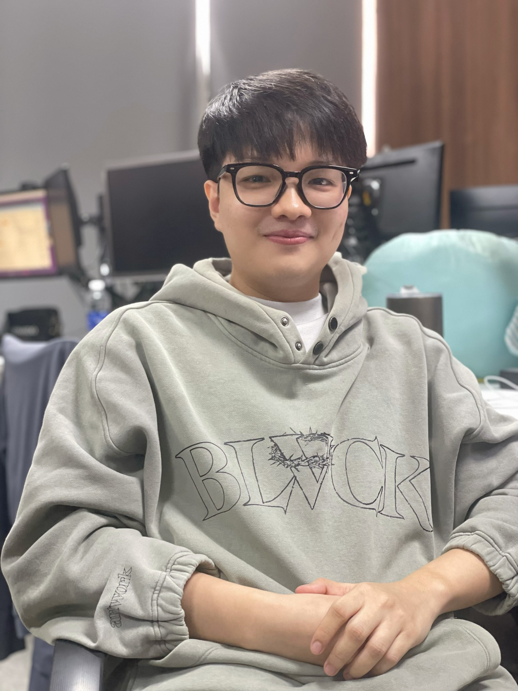

<div align="center">
  
  
  <h1>Tran Anh Duc</h1>
  <p><b>Cross-Platform Developer</b></p>
  <p>
    
    
    
    
  </p>
  <p>
    <a href="https://github.com/ocean28799"></a>
    <a href="https://www.linkedin.com/in/trananhduc99/"></a>
    <a href="mailto:ocean28799@gmail.com"></a>
  </p>
</div>

---


## 👋 About Me

- 🚀 <b>4+ years</b> building scalable web & mobile applications
- 🏆 <b>50+ projects</b> delivered for startups and enterprises
- 👨‍💻 <b>15+ developers</b> mentored in React and mobile development
- 🌐 Focused on <b>performance, scalability, and seamless UX</b>


## ✨ Features

- Modern responsive design
- Project showcase
- About me & philosophy
- Experience and skills
- Downloadable resume ([View PDF](public/files/TranAnhDuc-ATS-ReactNative-CV.pdf))
- Tech feed

## Features
- Modern responsive design
- Project showcase
- About me section
- Experience and skills
- Resume download
- Tech feed


## 🚀 Getting Started

<details>
<summary><b>Setup Instructions</b></summary>

### Prerequisites
- Node.js (v18 or newer recommended)
- pnpm (or npm/yarn)

### Installation
```bash
pnpm install
```

### Development
```bash
pnpm dev
```

### Build
```bash
pnpm build
```

### Start
```bash
pnpm start
```
</details>


## 🛠️ Customization
- Update content in the `src/` directory (about, experience, projects, etc.)
- Replace images and assets in the `public/` folder


## 📫 Contact

- 📧 Email: [ocean28799@gmail.com](mailto:ocean28799@gmail.com)
- 🐙 GitHub: [ocean28799](https://github.com/ocean28799)
- 💼 LinkedIn: [trananhduc99](https://www.linkedin.com/in/trananhduc99/)


---

<div align="center">
  <sub>Made with ❤️ by Tran Anh Duc | MIT License</sub>
</div>
