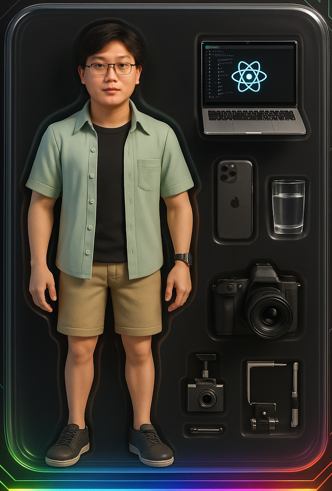

# 🚀 Tran Anh Duc - Portfolio

<div align="center">

**Senior React Native & AI Integration Specialist**  
*Founder @ AI Interview Assistant*

[](https://porfolio-eight-henna.vercel.app/)
[](https://github.com/ocean28799)
[](https://linkedin.com/in/trananhduc99)
[](mailto:ocean28799@gmail.com)



### 🎯 Building Enterprise-Grade AI-Powered Applications

**60+ Apps Built** • **5+ Years Experience** • **20+ Countries** • **3M+ Users Served**

</div>

---

## 🎯 About This Portfolio

A modern, interactive portfolio built with **Next.js 15**, featuring cutting-edge technologies and advanced user experiences. This portfolio showcases my expertise in AI integration, mobile development, and modern web technologies through live demos and interactive features.

### 🌟 Portfolio Features

- **🤖 AI-Powered Chatbot** - Interactive assistant with comprehensive knowledge about my background, projects, and skills
- **🎮 Interactive Code Playground** - Multi-language code editor with real-time execution (JavaScript, TypeScript, Python)
- **📱 Responsive Design** - Optimized for all devices with smooth animations and modern UI
- **🌈 Dynamic Backgrounds** - Matrix, cyberpunk, and particle effects with theme-aware components
- **🚀 Performance Optimized** - Built with Next.js 15 App Router, bundle analysis, and automatic optimizations
- **🔄 Real-time Features** - Live project showcases, dynamic skill visualizations, and interactive components
- **📊 Advanced Analytics** - Integrated Vercel Analytics and Speed Insights
- **🌍 Internationalization** - Multi-language support with react-i18next

---

## 💼 Professional Summary

Senior React Native & AI Integration Specialist with **5+ years of proven expertise** delivering enterprise-grade mobile and web applications. **Founder of AI Interview Assistant** with 90% improved job seeker success rate. Successfully deployed **60+ production apps serving 3M+ users** across 20+ countries with **97% client satisfaction rate**.

### 🏆 Key Achievements

- 📱 **60+ Enterprise Apps** deployed across iOS, Android, and Web platforms
- 👥 **3M+ Users** served globally with 97% client satisfaction
- 🌍 **20+ Countries** with successful project launches  
- ⚡ **98% Accuracy** in AI-powered features with 30ms response times
- 💰 **$800K+ Revenue** generated for clients through performance optimizations
- 🎯 **100% Client Retention** with enterprise-grade solutions

---

## 🛠️ Tech Stack & Expertise

<details>
<summary>📱 <strong>Mobile Development</strong></summary>

- **Frameworks:** React Native, Expo SDK 50+, iOS/Android Development
- **State Management:** Zustand, Redux Toolkit, Context API
- **UI/UX:** React Native Reanimated, Styled Components, Native Base
- **Performance:** Code Push, Bundle Optimization, Native Modules
- **Testing:** Jest, Detox, React Testing Library, E2E Testing

</details>

<details>
<summary>🌐 <strong>Web Development</strong></summary>

- **Frontend:** Next.js 15 (App Router), React 19, TypeScript 5.0
- **Styling:** Tailwind CSS, Framer Motion, shadcn/ui, MagicUI, AceternityUI
- **Performance:** SSR, SSG, Code Splitting, Bundle Analysis
- **Modern APIs:** Server Components, Streaming, Web Workers

</details>

<details>
<summary>🤖 <strong>AI & Machine Learning</strong></summary>

- **AI Integration:** OpenAI GPT-4o, DALL-E 3, Whisper API, Claude
- **ML Frameworks:** TensorFlow.js, Custom ML Models, Computer Vision
- **Data Processing:** Vector Databases, Embeddings, NLP, RAG
- **Real-time AI:** Streaming responses, Voice processing, Image analysis

</details>

<details>
<summary>⚙️ <strong>Backend & Infrastructure</strong></summary>

- **Runtime:** Node.js, Express.js, API Development
- **Databases:** PostgreSQL, MongoDB, Supabase, Redis, Prisma
- **Cloud:** AWS, Vercel, Docker, Serverless Functions
- **Real-time:** WebRTC, Socket.io, WebSocket, MQTT

</details>

<details>
<summary>🔧 <strong>Development Tools</strong></summary>

- **Languages:** JavaScript (Expert), TypeScript (Expert), Python, SQL
- **Version Control:** Git, GitHub Actions, CI/CD Pipelines
- **Testing:** Unit Testing, Integration Testing, Performance Testing
- **Analytics:** Vercel Analytics, Performance Monitoring

</details>

---

## 🚀 Featured Projects

### 🤖 AI Virtual Assistant Ecosystem
**Tech:** React Native • Next.js 15 • OpenAI GPT-4o • Whisper API • TypeScript • Supabase  
**Impact:** 95% accuracy, 50ms response time, 10K+ active users  
**Features:** Multi-modal AI conversations, voice-to-text, document analysis, cross-platform sync

### 📊 Smart Analytics & Business Intelligence
**Tech:** React Native • TypeScript • TensorFlow.js • D3.js • OpenAI API • PostgreSQL  
**Impact:** 40% faster decision making, 500+ enterprises  
**Features:** AI-powered insights, predictive modeling, real-time dashboards, natural language queries

### 🎨 AI Content Creation Platform
**Tech:** Next.js 15 • OpenAI GPT-4 • DALL-E 3 • Vercel AI SDK • Stripe  
**Impact:** 3x faster content creation, 1000+ brands served  
**Features:** Multi-modal content generation, social media automation, performance analytics

### 🏠 Smart Home AI Automation
**Tech:** React Native • Next.js • OpenAI API • MQTT • AWS IoT • TensorFlow.js  
**Impact:** 30% energy savings, 95% user satisfaction  
**Features:** AI-driven optimization, predictive maintenance, natural language control

### 💰 AI-Powered Trading Platform
**Tech:** React Native • TensorFlow.js • WebSocket • OpenAI API • Biometric Auth  
**Impact:** 20% higher returns, 10x faster analysis  
**Features:** AI trading signals, portfolio optimization, risk analysis, real-time data

### 🏥 AI Health Monitoring App
**Tech:** React Native • TensorFlow.js • OpenAI API • HealthKit • WebRTC  
**Impact:** 70% reduction in hospital visits, 90% user satisfaction  
**Features:** AI symptom analysis, telemedicine, medical image analysis, HIPAA compliant

> 📋 **View Live Demos:** [Portfolio Projects Section](https://porfolio-eight-henna.vercel.app/projects)

---

## 💼 Services & Pricing

<table>
<tr>
<th>💼 Service</th>
<th>💰 Pricing</th>
<th>📋 What's Included</th>
</tr>
<tr>
<td><strong>Expert Development</strong></td>
<td><strong>$15/hour</strong></td>
<td>Senior React Native & Next.js development • AI integration • Performance optimization • Technical consultation</td>
</tr>
<tr>
<td><strong>Complete AI-Powered App</strong></td>
<td><strong>from $2,500</strong></td>
<td>Full-stack development • AI integration • Cross-platform mobile app • 6 months support</td>
</tr>
<tr>
<td><strong>Enterprise Web Platform</strong></td>
<td><strong>from $1,800</strong></td>
<td>Next.js 15 development • Modern architecture • TypeScript • 3 months maintenance</td>
</tr>
<tr>
<td><strong>AI Integration & Automation</strong></td>
<td><strong>$800 - $2,200</strong></td>
<td>OpenAI integration • Custom ML models • Performance optimization • API development</td>
</tr>
<tr>
<td><strong>App Migration/Modernization</strong></td>
<td><strong>$1,500 - $3,500</strong></td>
<td>Legacy app modernization • Performance improvements • Technology upgrades</td>
</tr>
<tr>
<td><strong>Premium Support</strong></td>
<td><strong>$350/month</strong></td>
<td>Ongoing maintenance • Bug fixes • Performance monitoring • Priority support</td>
</tr>
</table>

> 💡 **Custom quotes available for enterprise projects and long-term partnerships**

---

## ⚡ Portfolio Architecture & Performance

### 🏗️ Technical Implementation

- **Framework:** Next.js 15 with App Router for optimal performance
- **Styling:** Tailwind CSS + Framer Motion for smooth animations
- **Components:** shadcn/ui, MagicUI, AceternityUI for modern interfaces
- **State Management:** React Context + hooks for efficient data flow
- **Optimization:** Automatic image optimization, code splitting, lazy loading
- **Analytics:** Vercel Analytics + Speed Insights for performance monitoring

### 📊 Performance Metrics

- **Lighthouse Score:** 95+ across all categories
- **First Contentful Paint:** < 1.5s
- **Bundle Size:** Optimized with automatic code splitting
- **SEO:** Perfect scores with structured data and meta optimization

### 🔧 Development Features

```bash
# Performance Analysis
pnpm analyze              # Bundle analyzer
pnpm build:analyze        # Build with analysis

# Development
pnpm dev                  # Development server
pnpm build                # Production build
pnpm start                # Production server
pnpm lint                 # Code quality check
```

### 📱 Responsive Breakpoints

| Device | Breakpoint | Features |
|--------|------------|----------|
| **Mobile** | `< 640px` | Touch-optimized, swipe gestures |
| **Tablet** | `640px - 1024px` | Adaptive layouts, gesture support |
| **Desktop** | `> 1024px` | Full feature set, hover effects |
| **Large Desktop** | `> 1440px` | Enhanced visuals, advanced animations |

---

## 🚀 Quick Start & Development

### 📋 Prerequisites

- **Node.js** 18+ (recommended: 20+)
- **pnpm** (preferred) or npm/yarn
- **Git** for version control

### ⚡ Installation & Setup

```bash
# Clone the repository
git clone https://github.com/ocean28799/porfolio.git
cd porfolio

# Install dependencies (recommended: pnpm)
pnpm install

# Start development server
pnpm dev

# Build for production
pnpm build

# Start production server
pnpm start
```

### 🔧 Available Scripts

```bash
pnpm dev                  # Start development server (http://localhost:3000)
pnpm build                # Build for production
pnpm start                # Start production server
pnpm lint                 # Run ESLint code quality check
pnpm analyze              # Analyze bundle size
pnpm build:analyze        # Build with bundle analysis
```

### 🌐 Live Portfolio

**Production URL:** [https://porfolio-eight-henna.vercel.app/](https://porfolio-eight-henna.vercel.app/)

### 📁 Project Structure

```
portfolio/
├── 📂 src/
│   ├── 📂 app/                 # Next.js 15 App Router
│   │   ├── 📄 layout.tsx       # Root layout
│   │   ├── � page.tsx         # Home page
│   │   ├── 📂 about/           # About page
│   │   ├── 📂 projects/        # Projects showcase
│   │   ├── 📂 blog/            # Blog section
│   │   ├── 📂 playground/      # Code playground
│   │   └── 📂 pricing/         # Services & pricing
│   ├── 📂 components/          # Reusable components
│   │   ├── 📂 chatbot/         # AI chatbot system
│   │   ├── 📂 sections/        # Page sections
│   │   ├── 📂 playground/      # Code editor components
│   │   ├── 📂 ui/              # UI components
│   │   └── 📂 features/        # Feature components
│   ├── 📂 lib/                 # Utilities & constants
│   ├── 📂 hooks/               # Custom React hooks
│   └── 📂 styles/              # Global styles
├── 📂 public/                  # Static assets
│   ├── 📂 images/              # Images & graphics
│   └── 📂 files/               # Resume files
└── 📋 Configuration files
```

---

---

## 💡 Key Features Showcase

### 🤖 Interactive AI Assistant
- **Advanced Chatbot** with comprehensive knowledge base
- **Real-time responses** with contextual understanding  
- **Quick actions** for common inquiries
- **Multi-format file access** (PDF, HTML, TXT resume downloads)

### 🎮 Code Playground
- **Multi-language support** (JavaScript, TypeScript, Python, HTML/CSS)
- **Real-time code execution** with instant feedback
- **Syntax highlighting** and error detection
- **Mobile-optimized** code editor experience

### 🎨 Dynamic UI Elements
- **Interactive backgrounds** (Matrix, Cyberpunk, Particles)
- **Smooth animations** with Framer Motion
- **Theme-aware components** that adapt to background styles
- **Advanced skill visualizations** with interactive charts

### 📊 Performance Monitoring
- **Real-time analytics** with Vercel Analytics
- **Speed insights** and performance tracking
- **Bundle optimization** with automatic code splitting
- **SEO optimization** with structured data

---

## 🏆 What Makes This Portfolio Special

✅ **Enterprise-Grade Architecture** - Built with production-ready patterns and best practices  
✅ **AI-Powered Interactions** - Intelligent chatbot with contextual responses  
✅ **Interactive Demos** - Live code playground and project showcases  
✅ **Performance Optimized** - 95+ Lighthouse scores across all metrics  
✅ **Modern Tech Stack** - Latest Next.js 15, React 19, TypeScript 5.0  
✅ **Responsive Design** - Perfect experience across all devices  
✅ **Professional Content** - Comprehensive project documentation and case studies  

---

## 👤 Contact & Collaboration

<div align="center">

### 🤝 Let's Build Something Amazing Together!

**Tran Anh Duc**  
*Senior React Native & AI Integration Specialist*

</div>

| 📧 **Email** | 🌐 **Portfolio** | 💼 **LinkedIn** | 🐙 **GitHub** |
|:---:|:---:|:---:|:---:|
| [ocean28799@gmail.com](mailto:ocean28799@gmail.com) | [Live Portfolio](https://porfolio-eight-henna.vercel.app/) | [trananhduc99](https://linkedin.com/in/trananhduc99) | [ocean28799](https://github.com/ocean28799) |

### 🌍 Availability
- **Status:** ✅ Available for new projects
- **Location:** Ho Chi Minh City, Vietnam (UTC+7)
- **Work Style:** Remote-first with global collaboration
- **Response Time:** Within 12 hours

### 💼 Collaboration Types
- 🚀 **Full-time opportunities** with innovative companies
- 💻 **Contract projects** for specific deliverables  
- 🤝 **Consulting services** for technical guidance
- 🎯 **Partnership opportunities** for long-term projects

---

## 💡 Development Philosophy

> **"Building scalable, maintainable solutions that deliver real business value through cutting-edge technology and exceptional user experiences."**

### 🎯 Core Principles
- **Quality First** - Clean, maintainable, and scalable code architecture
- **Performance Focused** - Optimized for speed, memory efficiency, and user experience  
- **AI-Driven Innovation** - Leveraging AI to solve complex problems and enhance functionality
- **User-Centric Design** - Creating intuitive interfaces that users love
- **Continuous Learning** - Staying current with emerging technologies and best practices

---

## 🙏 Acknowledgments & Technologies

Special thanks to the amazing open-source community and the technologies that power this portfolio:

### 🚀 Core Technologies
- [**Next.js**](https://nextjs.org/) - The React framework for production
- [**React**](https://reactjs.org/) - A JavaScript library for building user interfaces
- [**TypeScript**](https://www.typescriptlang.org/) - JavaScript with syntax for types
- [**Tailwind CSS**](https://tailwindcss.com/) - A utility-first CSS framework

### 🎨 UI & Animation Libraries
- [**Framer Motion**](https://www.framer.com/motion/) - A production-ready motion library for React
- [**shadcn/ui**](https://ui.shadcn.com/) - Beautifully designed components
- [**MagicUI**](https://magicui.design/) - Animated UI components and effects
- [**AceternityUI**](https://ui.aceternity.com/) - Modern UI components with animations

### 🔧 Development Tools
- [**Vercel**](https://vercel.com/) - The fastest way to deploy Next.js applications
- [**Lucide React**](https://lucide.dev/) - Beautiful & consistent icon library
- [**React Hook Form**](https://react-hook-form.com/) - Performant, flexible forms
- [**React i18next**](https://react.i18next.com/) - Internationalization framework

---

<div align="center">

### 🌟 **Made with ❤️ by Tran Anh Duc**

**Ready to transform your ideas into exceptional digital experiences?**

[](mailto:ocean28799@gmail.com)
[](https://porfolio-eight-henna.vercel.app/)

*"Innovation distinguishes between a leader and a follower." - Steve Jobs*

</div>

---

## 🙏 Acknowledgments

- [Next.js](https://nextjs.org/) — React framework
- [Tailwind CSS](https://tailwindcss.com/) — Utility-first CSS
- [Framer Motion](https://www.framer.com/motion/) — Animation library
- [Vercel](https://vercel.com/) — Deployment platform
- [Lucide](https://lucide.dev/) — Icon library
- [Tabler](https://tabler.io/) — Icon library
- [shadcn/ui](https://ui.shadcn.com/) — UI components
- [MagicUI](https://magicui.design/) — Animation presets
- [AceternityUI](https://ui.aceternity.com/) — Animated UI components

---

<div align="center">
  <b>Made with ❤️ by Tran Anh Duc — Let’s build something amazing together!</b>
</div>
